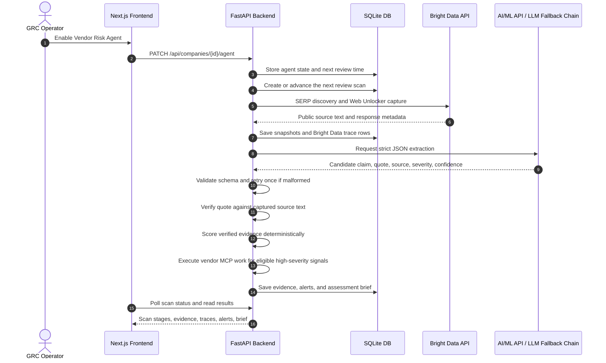

<p align="center">
  
</p>

<h1 align="center">Pulse: Autonomous Vendor Risk Agent</h1>

<p align="center">
  <strong>Continuous, evidence-backed third-party risk assessment powered by autonomous web intelligence.</strong>
</p>

<p align="center">
  <a href="#license"></a>
  
  
  
  
</p>

---

## Table of Contents

- [Executive Summary](#executive-summary)
- [Key Features & Product Surfaces](#key-features--product-surfaces)
  - [Command Center](#command-center)
  - [Evidence Drawer & Source Explorer](#evidence-drawer--source-explorer)
  - [Vendor Risk Assessment Brief](#vendor-risk-assessment-brief)
- [How It Works: The Autonomous Pipeline](#how-it-works-the-autonomous-pipeline)
  - [The Bounded Agent Stages](#the-bounded-agent-stages)
  - [Pipeline Sequence Diagram](#pipeline-sequence-diagram)
- [Product Invariants & Safeguards](#product-invariants--safeguards)
  - [Evidence-Quote Verification](#evidence-quote-verification)
  - [Deterministic Risk Scoring](#deterministic-risk-scoring)
- [System Architecture](#system-architecture)
  - [Frontend Stack](#frontend-stack)
  - [Backend Stack](#backend-stack)
  - [Database Schema](#database-schema)
- [Configuration & Environment Variables](#configuration--environment-variables)
- [Getting Started](#getting-started)
  - [Prerequisites](#prerequisites)
  - [Backend Setup](#backend-setup)
  - [Frontend Setup](#frontend-setup)
- [Demo Quickstart Checks](#demo-quickstart-checks)
- [License](#license)

---

## Executive Summary

Mid-market security, legal, and GRC teams are drowning in vendor-risk noise. Traditional annual questionnaires go stale quickly, while public vendor changes can happen between review cycles: trust center updates, status incidents, pricing or terms changes, and adverse-media mentions.

**Pulse** is a bounded autonomous vendor risk agent. A user adds exact vendor domains, enables realtime autonomous review, and Pulse continuously updates the command center as new scans complete. Bright Data collects public evidence, AI/ML API extracts structured findings, deterministic quote verification checks that claims are actually supported by captured source text, and only verified signals can score.

Pulse separates two customer-facing concepts:

- **New alert:** Pulse found a new or changed scored finding that needs attention.
- **Latest score:** the most recent scored finding for that vendor, kept visible until a newer scored alert replaces it.

> [!NOTE]
> Pulse only works on public, company-level sources such as trust hubs, security pages, status pages, pricing pages, terms pages, and targeted public adverse-media results. It does not use private, login-only, credentialed, or unauthorized sources.

---

## Key Features & Product Surfaces

Pulse keeps the workflow focused on three approved product surfaces:

```text
Command Center
  -> Evidence Drawer & Source Explorer
  -> Vendor Risk Assessment Brief
```

### Command Center

- **Vendor watchlist:** Tracks monitored vendors, business owner, renewal date, active/inactive status, latest score, and unread alert state.
- **Realtime autonomous review:** Enabled vendors show realtime monitoring status and update as new review scans complete.
- **Operator lock:** Hosted deployments can require an operator token before any write or scan-triggering action is allowed.
- **Alert channels:** Email, WhatsApp, and Discord alert destinations can be configured from the agent panel.
- **Vendor MCP connections:** Vendor cards show whether a vendor MCP server is connected and reveal the MCP endpoint on demand.
- **Alert visibility:** Vendors with new scored findings move to the top and display a `New alert` badge. Opening the vendor marks the alert as seen.
- **Latest score persistence:** The latest scored alert remains visible even when the most recent review only confirms known evidence.
- **Agent status panel:** Shows review policy, next review time, current activity, and latest assessment status.
- **Review status strip:** Shows the bounded stages: **Collect -> Extract -> Verify -> Score -> Brief**.

### Evidence Drawer & Source Explorer

- **Evidence cards:** Shows verified, needs-review, no-evidence, and failed-source rows from the review.
- **Quote verification:** Displays the extracted quote beside the captured source excerpt so users can inspect support.
- **Bright Data trace rows:** Records product, operation, source URL, status, latency, retry count, timestamp, and source mode (`live`, `cached`, or `fallback`).
- **Source-mode honesty:** Live, cached, and fallback evidence are labeled rather than blended together.

### Vendor Risk Assessment Brief

- **Verified-evidence basis:** Briefs are generated from verified evidence only.
- **Evidence table:** Lists signal type, source URL, severity, source mode, verification status, and recommended action.
- **Risk interpretation:** AI-assisted assessment text can summarize verified findings, but it cannot bypass quote verification or deterministic scoring.
- **Pulse AI Agent Work:** High-severity outage and breach signals show the autonomous work Pulse completed through connected vendor MCP servers.
- **Outage response:** AWS and Cloudflare outage evidence can trigger provider migration work and close with an issue-resolved result.
- **Breach response:** Snowflake and Vercel breach evidence can trigger containment work such as credential rotation, MFA checks, OAuth review, and deployment or query-log verification.
- **Exports:** The UI supports Markdown and HTML export actions for the assessment brief.

---

## How It Works: The Autonomous Pipeline

Pulse does not run an open-ended browsing agent. It executes a bounded review cycle with explicit budgets and persisted telemetry.

### The Bounded Agent Stages

1. **Collect:** Pulse uses Bright Data SERP and Web Unlocker to discover and capture bounded public vendor-risk sources.
2. **Extract:** Captured text is processed by AI/ML API using `deepseek-v4-flash`. The configured fallback order is AI/ML API first, DeepSeek second, and Kiro last.
3. **Verify:** Extracted quotes are checked against the captured source text with exact or RapidFuzz matching at the configured `0.8` threshold.
4. **Score:** Only verified evidence can receive a deterministic score or create an alert.
5. **Brief:** Pulse renders a review-ready brief from verified findings and shows completed autonomous MCP work for high-severity incidents. Repeated unchanged findings stay auditable but do not create duplicate alerts.

### Pipeline Sequence Diagram



---

## Product Invariants & Safeguards

### Evidence-Quote Verification

AI models extract candidate evidence, but they do not validate claims by themselves.

- Each structured finding must include a literal `supporting_quote` and `source_url`.
- Pulse verifies that quote against the captured source text.
- Claims below the `0.8` quote-match threshold are not treated as verified.
- Unsupported evidence remains visible for inspection but does not create a high-priority alert.

### Deterministic Risk Scoring

The LLM does not assign the risk score. Pulse computes scores from verified evidence:

```text
SignalScore =
  base_severity
  * source_reliability
  * confidence
  * freshness
  * vendor_criticality

DisplayScore = min(100, round(SignalScore * 100))
```

Current scoring constants:

- **Base Severity:** `high = 0.9`, `medium = 0.6`, `low = 0.3`
- **Source Reliability:** `vendor_owned = 0.9`; other source types currently use the general default of `0.5`
- **Freshness:** exponential decay factor `e^(-0.1 * age_days)`
- **Vendor Criticality:** `critical = 1.2`, `important = 1.0`, `normal = 0.8`

The UI translates numeric scores into readable priority labels:

- `80-100`: Urgent
- `60-79`: High
- `30-59`: Medium
- `0-29`: Low

---

## System Architecture

### Frontend Stack

- **Framework:** Next.js 15, React 19, TypeScript
- **Styling:** Tailwind CSS with light/dark mode support
- **Icons:** Phosphor Icons
- **API boundary:** Frontend calls FastAPI only; it never calls Bright Data or LLM providers directly.

### Backend Stack

- **Framework:** FastAPI on Python 3.11+
- **Persistence:** SQLModel / SQLite
- **Validation:** Pydantic v2
- **HTTP client:** HTTPX
- **Quote matching:** RapidFuzz
- **Provider integrations:** Bright Data, AI/ML API, DeepSeek fallback, Kiro fallback, vendor MCP endpoints

### Database Schema

Pulse uses SQLite tables for the MVP:

1. **`companies`:** Vendor metadata, renewal dates, owners, agent state, and review policy.
2. **`scans`:** Review-cycle status, stage progression, and budget metrics.
3. **`evidence_items`:** Extracted claims, supporting quotes, verification status, source excerpts, and snapshot paths.
4. **`alerts`:** Scored findings and related-change cards.
5. **`brightdata_traces`:** Bright Data operation telemetry and source-mode labels.
6. **`briefs`:** Markdown and HTML assessment outputs.

---

## Configuration & Environment Variables

Configure Pulse by copying `.env.example` to `.env` inside both `/backend` and `/frontend`.

### Backend Configurations (`backend/.env`)

Core service:

- `DATABASE_URL`: default `sqlite:///./pulse.db`; local SQLite database path.
- `CORS_ALLOWED_ORIGINS`: default `http://localhost:3000,http://127.0.0.1:3000`; comma-separated frontend origins allowed to call the API.
- `DEFAULT_REVIEW_MODE`: default `live_with_fallback`; review mode: `live`, `replay`, or `live_with_fallback`.
- `DEMO_API_TOKEN`: optional operator token for hosted write protection.

Bright Data:

- `BRIGHTDATA_API_KEY`: required for live Bright Data collection.
- `BRIGHTDATA_SERP_ENDPOINT`: optional override for the Bright Data request endpoint.
- `BRIGHTDATA_WEB_UNLOCKER_ENDPOINT`: optional override for the Web Unlocker request endpoint.
- `BRIGHTDATA_SERP_ZONE`: required for live SERP discovery.
- `BRIGHTDATA_UNLOCKER_ZONE`: required for live Web Unlocker capture.
- `BRIGHTDATA_DEMO_SOURCE_URL`: optional approved demo URL for the Cloudflare live path.
- `BRIGHTDATA_LIVE_SNAPSHOT_DIR`: default `backend/app/snapshots/live`; optional directory for live source captures.
- `BRIGHTDATA_LIVE_FETCH_TIMEOUT_SECONDS`: default `8`; timeout for live page capture attempts.
- `BRIGHTDATA_SERP_TIMEOUT_SECONDS`: default `20`; timeout for SERP discovery requests.
- `FALLBACK_EVIDENCE_ENABLED`: default `false`; enables labeled fallback evidence for supported demo paths.

LLM providers:

- `AIMLAPI_API_KEY`: primary LLM provider key for AI/ML API.
- `AIMLAPI_API_ENDPOINT`: default `https://api.aimlapi.com/v1/chat/completions`.
- `AIMLAPI_EXTRACTION_MODEL`: default `deepseek-v4-flash`.
- `DEEPSEEK_API_KEY`: optional fallback provider key.
- `DEEPSEEK_API_ENDPOINT`: default `https://api.deepseek.com/chat/completions`.
- `DEEPSEEK_EXTRACTION_MODEL`: default `deepseek-v4-flash`.
- `KIRO_API_KEY`: optional Kiro fallback key.
- `KIRO_ENDPOINT`: default `https://q.us-east-1.amazonaws.com/`.
- `KIRO_EXTRACTION_MODEL`: default `claude-sonnet-4.5`.
- `LLM_EXTRACTION_ENABLED`: default `true`; enables AI-assisted structured extraction.
- `LLM_EXTRACTION_TIMEOUT_SECONDS`: default `12`; timeout for each LLM extraction call.

Scheduler:

- `AUTONOMOUS_SCHEDULER_ENABLED`: default `false`; enables background due-vendor scheduling.
- `AUTONOMOUS_SCHEDULER_INTERVAL_SECONDS`: default `10`; background scheduler tick interval.

### Frontend Configurations (`frontend/.env`)

- `NEXT_PUBLIC_API_BASE_URL`: default `http://localhost:8000`; FastAPI backend URL.

---

## Getting Started

### Prerequisites

- **Python 3.11+**
- **Node.js 18+**
- **npm** or a compatible package manager

### Backend Setup

```bash
cd backend
cp .env.example .env
python -m venv .venv
```

Windows PowerShell:

```powershell
.\.venv\Scripts\Activate.ps1
pip install -r requirements.txt
uvicorn app.main:app --reload
```

Linux / macOS:

```bash
source .venv/bin/activate
pip install -r requirements.txt
uvicorn app.main:app --reload
```

The backend runs at [http://localhost:8000](http://localhost:8000).

### Frontend Setup

```bash
cd frontend
cp .env.example .env
npm install
npm run dev
```

The frontend runs at [http://localhost:3000](http://localhost:3000).

---

## Demo Quickstart Checks

Run backend tests:

```bash
cd backend
python -m pytest
```

Run a credential-free demo check:

```bash
cd backend
python -m scripts.rehearse_demo
```

Run a controlled live demo check:

```bash
cd backend
python -m scripts.rehearse_demo --mode live_with_fallback
```

Run the recorded extraction quality baseline:

```bash
cd backend
python -m scripts.evaluate_extraction
```

Evaluate the configured model path against the extraction baseline:

```bash
cd backend
python -m scripts.evaluate_extraction --mode deepseek
```

> [!TIP]
> The extraction quality gate expects at least 4 out of 5 recorded pages to produce verified evidence at the RapidFuzz threshold of `>= 0.8`.

---

## License

Pulse is open-source software licensed under the [MIT License](./LICENSE).
